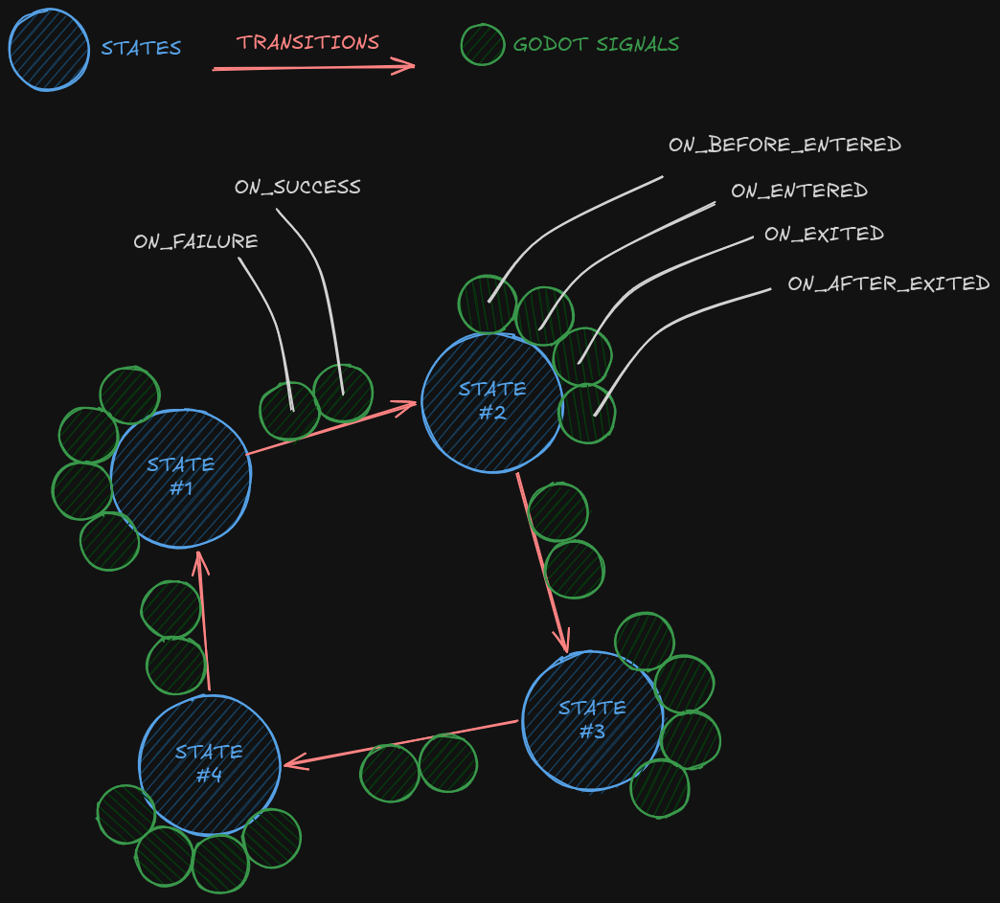

# general purpose state machine

A general purpose state machine which can express states and transitions between them. Feature are

  - Comes in a single file (addons/gpsm/code/gpsm_main.gd).
  - Does not clutter the name space, only adds GPSM as class.
  - Is not based on Nodes, but on a RefCounted script.
  - Provides 4 signals for each state and 2 signals for each transition.
  - Entirely based on Godot's signals.
  - Well documented (50% of code = amount of comments).
  - Good test coverage (200% of code = amount of tests).
  - Comes with gdunit4 tests.
  - Comes with example project.
  - Tests can be deleted (addons/gpsm/tests).
  - Examples can be deleted (addons/gpsm/examples).

Can be used as basis for more complex state machines or can be used as a fully functional state machine.
See code repository's README file for instructions or example sub-folder for a demo.

  - AssetLib: [Asset (#5380)](https://godotengine.org/asset-library/asset/5380).
    - 1st proposal at [Edit (#23828)](https://godotengine.org/asset-library/asset/edit/23828).
    - 2nd proposal at [Edit (#23837)](https://godotengine.org/asset-library/asset/edit/23837).
    - Update proposal for v1.2.0 at [Edit (#23844)](https://godotengine.org/asset-library/asset/edit/23844).
  - Github: [github.com/kraasch/godot-gpsm](https://github.com/kraasch/godot-gpsm).
    - asset download url for v1.0.1 on [github.com/kraasch/godot-gpsm](https://github.com/kraasch/godot-gpsm/archive/f142dc4597c40defa1680f4d280724d86576acb1.zip).
    - asset download url for v1.2.0 on [github.com/kraasch/godot-gpsm](https://github.com/kraasch/godot-gpsm/archive/18f5cdc8745cf89f372df1c324f3b2aa9790771a.zip).

## demo

<p align="center">
  
</p>

## code example

A little demo can be found in the `./addons/gpsm/examples/` sub-folder.

After downloading the plugin with the AssetLib tab or manually
and after enabling the plugin under `Project>Project Settings>Plugins`
the node `GPSM` will be available when adding a new node with the
new node dialog (e.g. after having the Scene tab open and pressing **ctrl+a**).

For creating and connecting a new state machine do as shown below.

```gdscript
# setup a state machine like this.

var _SM: GPSM
var _A: GPSM.State
var _B: GPSM.State
var _C: GPSM.State
var _D: GPSM.State
var _T0: GPSM.Transition
var _T1: GPSM.Transition
var _T2: GPSM.Transition
var _T3: GPSM.Transition
var _T4: GPSM.Transition
var _T5: GPSM.Transition

func _setup_testing_state_machine() -> void:
	_SM = GPSM.new()
	#     ---->   T0
	#  A  <---- B T1
	#  |        |
	#  | T4     | T5
	#  V        V
	#  C  ----> D T2
	#     <----   T3
	_A = _SM.new_state()
	_B = _SM.new_state()
	_C = _SM.new_state()
	_D = _SM.new_state()
	_T0 = _SM.new_transition(_A, _B)
	_T1 = _SM.new_transition(_B, _A)
	_T2 = _SM.new_transition(_C, _D)
	_T3 = _SM.new_transition(_D, _C)
	_T4 = _SM.new_transition(_A, _C)
	_T5 = _SM.new_transition(_B, _D)
```

connect state transitions or log failure as shown below.


```gdscript
	var collect_failures: Callable = func(message: String, transition: GPSM.Transition, current_state: GPSM.State):
		label.text = message
	for i: int in len(states):
		var state: GPSM.State = states[i]
		var visual_state: DemoState = visual_states[i]
		state.on_entered.connect(visual_state.blink)
		state.on_exited.connect(visual_state.stop_blink)
		state.on_entered.connect(func (): print('entered state' + str(i)))
		state.on_exited.connect(func (): print('exited state' + str(i)))
	for i: int in len(transitions):
		var transition: GPSM.Transition = transitions[i]
		var arrow: DemoArrow = arrows[i]
		arrow.inner_transition = transition
		transition.on_failure.connect(arrow.blink)
		transition.on_failure.connect(func (msg, t, s): print('failed transition: ' + str(msg)))
		transition.on_failure.connect(collect_failures)
	_SM.initialize()
```

the intial state transition when calling the statem machine's `initialize()` function can be toggled on or off.

the machine can throw warnings, when transitions are triggered during the wrong state.

individual transitions can also be troggled.

```gdscript
# will create push_warning() or push_error()
	_SM.throw_type = GPSM.THROW_TYPE.SILENT
	_SM.throw_type = GPSM.THROW_TYPE.ERROR
	_T3.throw_type = GPSM.THROW_TYPE.WARNING

# or connect a custom function to transition failure.
	var collect_failures: Callable = func(message: String, transition: GPSM.Transition, current_state: GPSM.State):
		custom_messages.append(message)
		transitions.append(transition)
		states.append(current_state)
	_T3.on_failure.connect(collect_failures)
```

## license

see [license file](.addons/gpsm/LICENSE).


## credits

see web repository's [contributions](https://github.com/kraasch/godot-gpsm).

